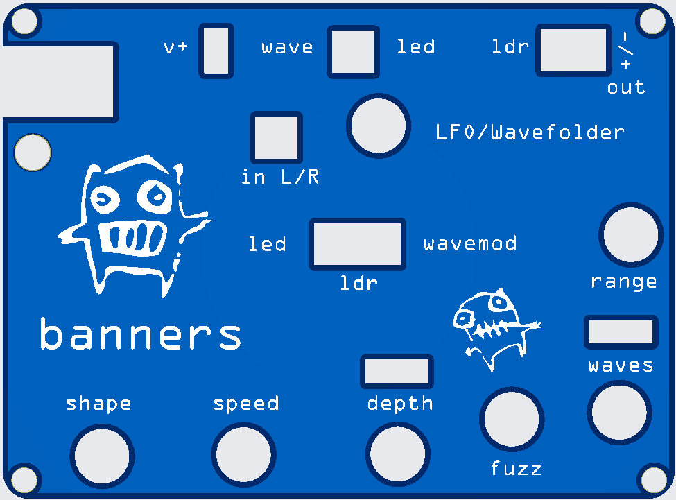
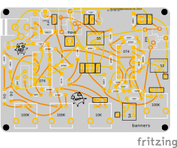
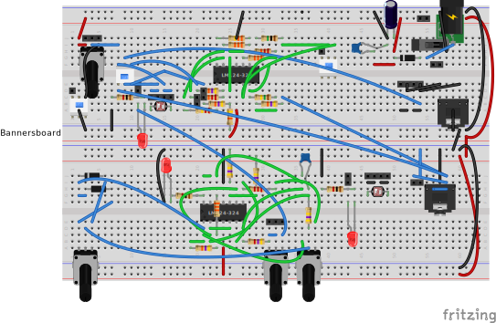
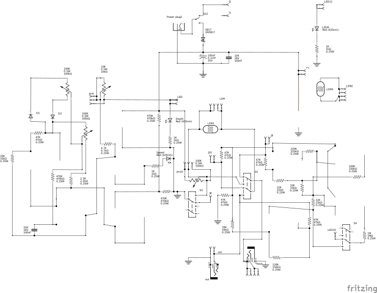

# banners
Banners is a wave folder and lfo. It has two forms. One for the keep and one for modular systems.

Unlike most wavefolders, it does not use pairs of PNP/NPN transistors. This design uses a quad op amp (TL074) and adds an LFO (TL074 or LM324). There are 3 stages of folding with the first 2 being symetrical and the 3d being fuzzy. 

Banner is designed so you can also bypass the wavefolder and just use the LFO on an input signal. It also has an additional vactrol for screwing about!

